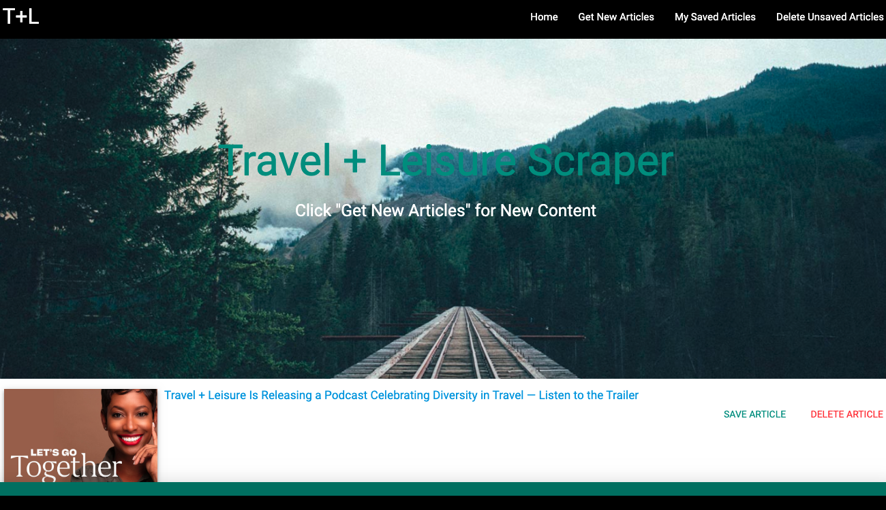

# Travel + Leisure Mongo-Scraper
Full-stack web application that lets users view, save and leave comments on the latest Travel + Leisure articles.

## Overview: 
The Travel + Leisure Mongo-Scraper app uses Mongoose (ODM) for MongoDB to manage relationships between data and Handlebars to generate the HTML.

## Author:
Lindsey Tummond
- <a href="https://lindseytummond.github.io/portfolio/" target="_blank"> Portfolio </a>
- <a href="https://github.com/lindseytummond" target="_blank"> GitHub </a>
- <a href="https://www.linkedin.com/in/lindsey-tummond-b86aa341/" target="_blank"> LinkedIn </a>

## Future Enhancements:
Future developments would include creating additional features to isolate specific subtopics to scrape (ex: 'Destination of the Year,' 'Cruises,' and 'Travel Tips') to be able to store comments for each travel subtopic.

## Learning Points:
- Trial and error of using axios to isolate specific HTML.
    - Difficult time drilling down and isolating the image tag from the T+L website
- Utilizing Handlebars templates to generate client-side HTML.

## Technologies:
-	Javascript
-   Materialize
-	NPM package
    -	Axios
    -   Cheerio
    -   Express
    -   Handlebars
    -   Mongoose
-   GitHub
-   Heroku

## How to Use:
Use the following link https://infinite-escarpment-80167.herokuapp.com/ to open the application.  
Select 'Get New Articles' to scrape the Travel + Leisure site.  
Browse the articles and elect to 'Save Article' or 'Delete Article'.  
Articles a user saves will be complied under 'My Saved Articles' tab in the navigation bar.  
Under 'My Saved Articles,' users have the ability to 'Add Note,' 'Manage Note,' and 'Delete Article' based on preference.  
Lastly, 'Delete Unsaved Articles' will remove all scraped, unsaved articles from view.

## App Example:

